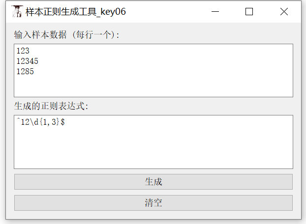
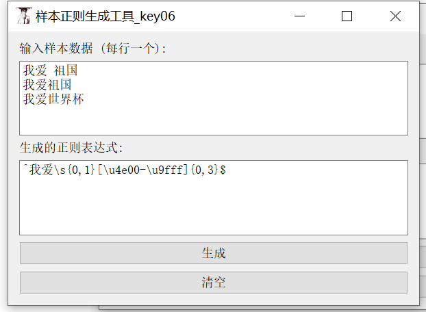
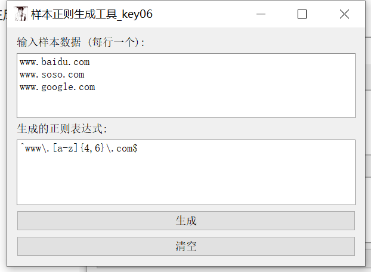

这是一款基于C++编写的简单样本统计字符的正则表达生成工具

如下所示：

1、根据数字生成正则：

输入

123

12345

1285

生成正则为^12\d{1,3}$

2、根据中文生成正则：

输入

我爱 祖国

我爱祖国

我爱世界杯

生成正则为^我爱\s{0,1}[\u4e00-\u9fff]{0,3}$

3、根据网址生成正则：

输入

www.baidu.com

www.soso.com

www.google.com

生成正则^www\.[a-z]{4-6}\\.com$

